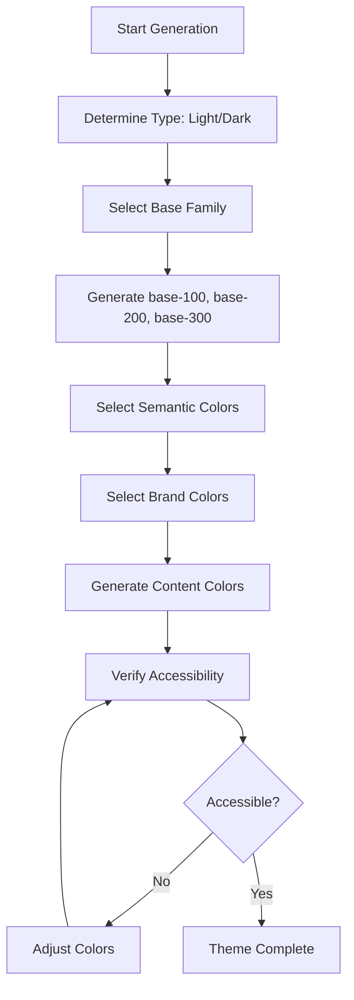

# Theme Generation System Guide

## Overview

This system generates cohesive random themes using Material Design colors and the `culori` library for precise color manipulation. The goal is to automatically create visually appealing and accessible themes.

## System Architecture

### 1. Color Foundation

#### Material Design Colors
```typescript
// Colors defined in HEX and automatically converted to OKLCH
const MATERIAL_COLORS_HEX = {
  "red-50": "#FFEBEE",
  "red-100": "#FFCDD2",
  // ... up to red-900
  "blue-50": "#E3F2FD",
  // ... etc
}

// Automatic conversion to OKLCH for better manipulation
export const MATERIAL_COLORS = Object.fromEntries(
  Object.entries(MATERIAL_COLORS_HEX).map(([key, hex]) => [key, convertHexToOklch(hex)])
);
```

**Why OKLCH?**
- Better luminance perception
- More precise saturation and hue manipulation
- More accurate contrast calculations

### 2. DaisyUI Theme Structure

A complete theme includes these CSS variables:

```css
:root {
  /* Base colors (main backgrounds) */
  --color-base-100: oklch(98% 0.002 247.839);  /* Primary background */
  --color-base-200: oklch(96% 0.003 264.542);  /* Secondary background */
  --color-base-300: oklch(92% 0.006 264.531);  /* Tertiary background */
  --color-base-content: oklch(21% 0.034 264.665); /* Text on base backgrounds */
  
  /* Brand colors */
  --color-primary: oklch(62% 0.214 259.815);
  --color-primary-content: oklch(98% 0.02 259);
  --color-secondary: oklch(54% 0.245 262.881);
  --color-secondary-content: oklch(98% 0.02 262);
  
  /* Semantic colors */
  --color-info: oklch(68% 0.169 237.323);
  --color-success: oklch(69% 0.17 162.48);
  --color-warning: oklch(76% 0.188 70.08);
  --color-error: oklch(63% 0.237 25.331);
  /* ... more content colors */
}
```

## 3. Theme Generation Algorithm

### Step 1: Theme Type Determination

```javascript
const isDarkTheme = Math.random() > 0.5;
```

### Step 2: Base Color Generation

Base colors form the main color family of the theme:

```javascript
// Color families for base themes
const baseColorFamilies = [
  ["gray", "blue-gray"], // 70% probability (neutrals)
  ["red", "pink", "purple", "deep-purple", "indigo", "blue", 
   "light-blue", "cyan", "teal", "green", "light-green", 
   "lime", "yellow", "amber", "orange", "deep-orange", "brown"] // 30% probability
];

// For light theme
if (!isDarkTheme) {
  base-100 = color-50   // Lightest background
  base-200 = color-100  // Intermediate background
  base-300 = color-200  // Darker background
}

// For dark theme
if (isDarkTheme) {
  base-100 = color-900  // Lightest background (but dark)
  base-200 = color-800  // Intermediate background
  base-300 = color-700  // Darker background
}
```

### Step 3: Semantic Colors

Specific colors are selected for each purpose:

```javascript
// Info: blues (cyan, sky, blue, light-blue)
info = selectColorFromFamily(["cyan", "sky", "blue", "light-blue"], ["400", "500", "600"])

// Success: greens (lime, green, emerald, teal, light-green)
success = selectColorFromFamily(["lime", "green", "emerald", "teal", "light-green"], ["400", "500", "600"])

// Warning: yellows/oranges (yellow, amber, orange, deep-orange)
warning = selectColorFromFamily(["yellow", "amber", "orange", "deep-orange"], ["400", "500", "600"])

// Error: reds (red, pink, rose)
error = selectColorFromFamily(["red", "pink", "rose"], ["400", "500", "600"])
```

### Step 4: Brand Colors

Primary, secondary, accent colors are selected with specific weights:

```javascript
const brandColorWeights = {
  // Material Design colors with balanced weights
  "deep-purple": 4,    // Higher probability
  "light-blue": 3,
  "light-green": 3,
  brown: 2,            // Lower probability
  "blue-gray": 3,
  // ... etc
};
```

### Step 5: Content Color Generation

For each background color, text color is automatically generated:

```javascript
function generateContrastColor(backgroundOKLCH) {
  const bgColor = converter("oklch")(backgroundOKLCH);
  const { l, h } = bgColor;
  const hue = h || 0;

  // If background is light (l > 0.5), use dark text
  // If background is dark (l <= 0.5), use light text
  const isLight = l > 0.5;
  const contrastL = isLight ? 0.15 : 0.98;
  
  return `oklch(${Math.round(contrastL * 100)}% 0.02 ${Math.round(hue)})`;
}
```

## 4. Accessibility Verification

Uses `wcagContrast` from culori to verify contrasts meet WCAG AA (4.5:1):

```javascript
function selectAccessibleColorPair(colors, shades) {
  // Tries 10 times to find an accessible combination
  for (let i = 0; i < 10; i++) {
    const backgroundColor = selectRandomColor(colors, shades);
    const textColor = generateContrastColor(backgroundColor);
    
    const contrast = wcagContrast(
      converter("oklch")(backgroundColor),
      converter("oklch")(textColor)
    );
    
    if (contrast >= 4.5) {
      return backgroundColor; // ✅ Accessible
    }
  }
  // Fallback if no accessible combination found
}
```

## 5. Complete Generation Flow



## 6. System Advantages

### Visual Cohesion
- **Color families**: All base colors come from the same Material family
- **Tonal harmony**: Preserved hue in content colors
- **Consistency**: Progressive shades (50→100→200 for light, 900→800→700 for dark)

### Accessibility
- **Automatic contrast**: WCAG AA verification in all combinations
- **Smart fallbacks**: If no accessible combination found, uses luminance calculations
- **OKLCH precision**: Better contrast perception than RGB/HSL

### Flexibility
- **Configurable weights**: Some colors appear more frequently than others
- **Material + Tailwind**: Compatible with both design systems
- **Dynamic themes**: Real-time generation without presets

## 7. Usage Example

```typescript
import { generateRandomTheme } from './utils/themeUtils';

// Generate random theme
const newTheme = generateRandomTheme();

// Example result:
{
  name: "theme-1703123456789",
  "--color-base-100": "oklch(98% 0.001 106.423)",      // stone-50
  "--color-base-200": "oklch(97% 0.001 106.424)",      // stone-100
  "--color-base-300": "oklch(92% 0.003 48.717)",       // stone-200
  "--color-base-content": "oklch(15% 0.02 106)",       // Dark text
  "--color-primary": "oklch(58% 0.233 277.117)",       // indigo-500
  "--color-primary-content": "oklch(98% 0.02 277)",    // Light text
  // ... rest of colors
}
```

## 8. Customization

To modify behavior:

```javascript
// Change brand color weights
const brandColorWeights = {
  "deep-purple": 6,  // Increase probability
  brown: 1,          // Decrease probability
};

// Change probability of neutral vs colorful themes
const baseColorNames = getRandomArray(baseColorFamilies, 0.8); // 80% neutrals

// Adjust shades for different effects
const brandShades = ["300", "400", "500"]; // Softer colors
```

This system guarantees visually cohesive, accessible, and varied themes using modern color science and the complete Material Design palette.

## File Organization

The system is organized into focused modules:

```
src/
├── types/
│   └── theme.ts              # Type definitions
├── colors/
│   ├── material.ts           # Material Design color definitions
│   └── palettes.ts           # Color palette configurations
├── utils/
│   ├── colorConversion.ts    # OKLCH conversion utilities
│   ├── contrastCalculation.ts # Accessibility calculations
│   └── colorSelection.ts     # Color selection algorithms
└── lib/
    ├── themeGenerator.ts     # Main theme generation logic
    └── themeUtils.ts         # Theme manipulation utilities
```